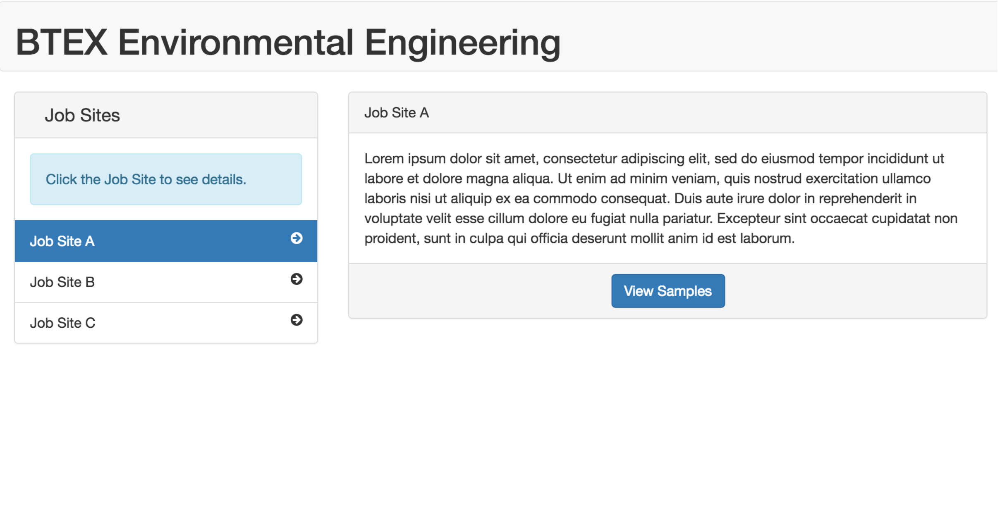
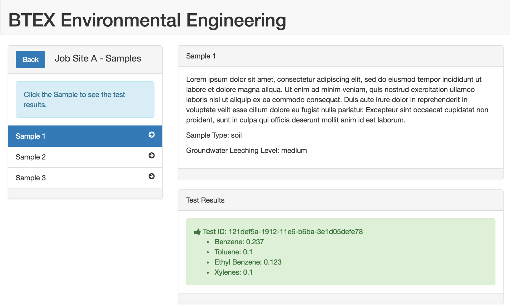
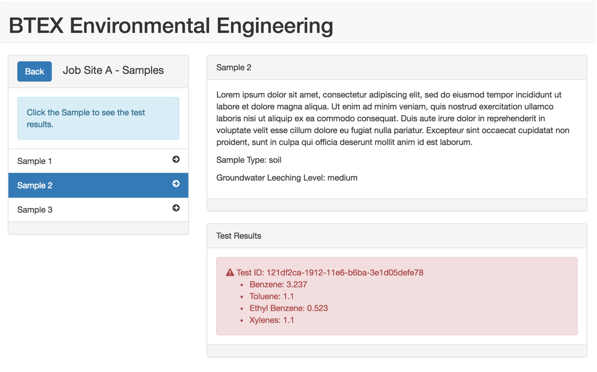

# TDK Angular 4 Test Project
Application demonstrating basic usage of Angular4, Flex, and BreezeJS, along with our DAO pattern for managing business objects in the client.

## Background
The purpose of this project is to establish your level of familiarity with the following:

* Git version control, and to a lesser degree bitbucket
* Angular 4 [https://angular.io/](https://angular.io/)
* Material Design [https://material.io/guidelines/#](https://material.io/guidelines/#)
* UI Router [https://ui-router.github.io/](https://ui-router.github.io/)
* BreezeJS [http://breeze.github.io/doc-js/](http://breeze.github.io/doc-js/)
* Node Package Manager

The best way to get up to speed with these concepts is to look at the code and structure of the angular2-test application itself. For this assignment, understanding what's going on in the **app** and **core** folders will be a requirement to successfully completing this exercise.

If you end up adding a new Sass file just make sure to import it into the **theme.scss** file.

Other gaps in your knowledge can be filled by reading the linked documentation above.

The project you will be working on is a line of business application for a hypothetical business called "BTEX Environmental Engineering, Inc. (BTEX EE Inc.)". This is an environmental engineering company which specializes in cleanup of soil that has been contaminated by leaking petroleum products, using bioremediation technology (microbes which consume hydrocarbons). The vision of the app is so that BTEX EE employees can view the company job sites, see the soil samples taken at each job site, and determine whether a given sample is contaminated with Volatile Organic Compounds (VOCs). This will help the company determine if a job site is a candidate for their cleanup services. 

#Getting Started

## Quick Start

These instructions are geared towards OSX, Linux and Unix users. If you are using a Windows machine, the steps are almost identical except certain commands may be different, such as "sudo" is replaced by opening a Windows command prompt as an Administrator.

Where you see https://{{your bitbucket username}}@bitbucket.org/{{your bitbucket username}}/tdktechnologies/angular2-test in the docs below, after replacing your username it should look something like this: https://bsolovic@bitbucket.org/bsolovic/tdktechnologies/angular2-test.git

You will need Node.js and Git installed. You will need an account on bitbucket.org. You will also need a MySQL Database running, which you can easily get using XAMPP.

Once your webserver, Node.js and Git are setup, you should fork this repository on Bitbucket, so you can make commits to your forked version of the repository to complete your work. The "Fork" button on the left navigation menu in bitbucket is the easiest way to do this.

After you fork the repository, please invite users **spencercope** and **bsolovic** to your forked repo with read permissions. These are your TDK resources and will need to see your code to review and collaborate as needed.

You should probably be using an IDE like Intellij or Eclipse with Git, Node and Grunt integration to do this project.
However, you may also work from the command line as follows:

```sh
$ cd /path-to-ide-projects-folder
$ git clone https://{{your bitbucket username}}@bitbucket.org/{{your bitbucket username}}/tdktechnologies/angular2-test.git
$ cd angular2-test
$ npm install
$ npm run serve
```

Note: make sure your user has adequate permissions to create directories within the angular2-test folder, otherwise the dependency management and build processes will fail.

Finally, open `http://localhost:4200/` in your browser.

At this point, your environment is setup and you are ready to start developing!

username: `groot`

password: `iamgroot`

# Test Project Instructions

Remember the vision of this application, according to the Product Owner:

"The vision of the app is so that BTEX EE Inc. employees can view the company job sites, see the soil samples taken at each job site, and determine whether a given sample is contaminated with Volatile Organic Compounds (VOCs). This will help the company determine if a job site is a candidate for their cleanup services."

Currently, you should notice that the current product increment (the web application) already has the ability to view job sites. It even has a button to view the samples. However, the button doesn't work. So, to get to the shippable product which meets the Product Owner's vision, we need to complete the following user stories, which are below.

## User Story 1

**As a BTEX EE Inc. Engineer, I would like to see the lab results of soil samples for a given job site, so that I can determine whether the job site needs our soil cleanup services.**

Assumptions: The Job Site screen is complete and has a button called 'View Samples' in the Job Site detail footer.

Acceptance Criteria:

* When the "View Samples" button is clicked, the user navigates to the "Samples" view.

* The samples view displays the samples taken at that job site in a list on the left, like the list of job sites on the job site screen.

* When a user clicks a sample in the list, the sample's details are displayed in the detail view on the right.

* The detail view includes the sample name, id, detail, type, groundwater leeching level, and the test result.

* The samples test result should display the raw values, in parts per million (PPM) of the following hydrocarbon molecules: Benzene, Toluene, Ethyl Benzene, and Xylene.

## User Story 2

**As a BTEX EE Inc. Engineer, I would like the app to automatically calculate the contamination "pass/fail" status of lab results, so that I do not need to manually calculate them.**

Assumptions: The samples screen is complete and the raw test results for each BTEX compound is visible on the screen.

Acceptance Criteria:

* When a sample is of type "soil" and has groundwaterLeeching of "low", a sample passes the contamination test (i.e. is not considered contaminated) if the BTEX compounds (benzene, toluene, ethyl benzene, and xylene) are all below 50 ppm (parts per million).

* If a sample of type "soil" and with groundwaterLeeching of "low" has any BTEX reading at or above 50 ppm, the sample fails and is considered contaminated.

* When a sample is of type "soil" and has groundwaterLeeching of "medium", a sample passes the contamination test (i.e. is not considered contaminated) if the BTEX compounds Benzene and Toluene are below 0.3 ppm, and the BTEX compounds Ethyl Benzene and Xylene are all below 1 ppm.

* If a sample of type "soil" and with groundwaterLeeching of "medium" has any BTEX Benzene or Toluene reading above 0.3 ppm, or any BTEX compounds Ethyl Benzene and Xylene above 1 ppm,
the sample fails and is considered contaminated.

* When a sample passes the contamination test, its test results should be in a alert-success block with light green background.

* When a sample fails the contamination test, its test results should be in a alert-warning block with red background.

## Prototypes

NOTE: The screenshots provided are from a previous version, so be sure to keep the current look of the application in mind.

### Job Sites


### Passing Sample


### Failing Sample

